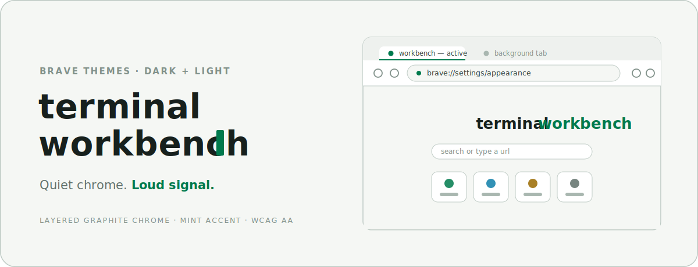

<div align="center">

<picture>
  <source media="(prefers-color-scheme: dark)" srcset="docs/assets/cover-dark.svg" />
  
</picture>

</div>

# Terminal Workbench for Brave

[](https://github.com/Real-Fruit-Snacks/terminal-workbench-brave/releases/latest)
[](LICENSE)
[](https://brave.com)

A modern terminal-inspired theme for [Brave](https://brave.com), built for people who spend the day in panes, shells, logs, editors, and command palettes.

The design goal is not retro green-on-black nostalgia. It is a calm, dense, high-contrast working surface: layered green-graphite chrome, a single restrained mint accent, and color spent only where it carries meaning.

Companion to the [Terminal Workbench Obsidian theme](https://github.com/Real-Fruit-Snacks/terminal-workbench) — the same palette and design system, applied to the browser.

## Highlights

- Full dark and light modes, each a deliberate palette rather than an inversion
- Layered chrome: frame, toolbar, and address field read as stepped graphite surfaces
- Mint accent on the active tab and bookmark bar; cyan reserved for New Tab Page links
- WCAG AA contrast enforced at build time across every text and surface pair the theme controls
- Single token source: every color lives in one file, and both packages regenerate with one dependency-free command

## Installation

### From a release

1. Download `terminal-workbench-dark.zip` or `terminal-workbench-light.zip` from the [latest release](https://github.com/Real-Fruit-Snacks/terminal-workbench-brave/releases/latest) and extract it.
2. Open `brave://extensions` and enable **Developer mode** (top right).
3. Select **Load unpacked** and choose the extracted folder.

### From a clone

Follow steps 2–3 above, selecting `dist/terminal-workbench-dark` or `dist/terminal-workbench-light` directly from the repository.

The theme applies immediately; no restart is required.

## Switching and removing

Chromium allows one theme at a time: loading the other variant replaces the current one. To return to the default appearance, remove the extension from `brave://extensions` or use *Reset to default* under `brave://settings/appearance`.

**New Tab Page:** Brave places its own background image over the New Tab Page by default. To see the theme's New Tab colors, open the New Tab Page customization menu and disable the background image.

## Customization

Every color lives in [tokens.json](tokens.json), keyed by design-token name for both modes. After editing:

```sh
node build.mjs
```

The build (Node.js 18 or later, no dependencies) regenerates both packages and enforces a WCAG contrast gate over every text and surface pair it emits — 4.5:1 for primary text, 3:1 for de-emphasized UI. It refuses to write output if any pair falls below its target. Reload the theme from `brave://extensions` to apply changes.

## Scope

A Chromium theme styles the browser frame, toolbar, tab strip, bookmark bar, and New Tab Page colors. It cannot affect:

- Web page content or `brave://` pages
- Context menus, Shields, and settings panels
- Private windows, which use Brave's own styling

## Development

| Path | Purpose |
|---|---|
| `tokens.json` | Single source for every color, both modes |
| `build.mjs` | Generates both theme packages and runs the contrast gate |
| `dist/terminal-workbench-dark/` | Installable dark theme package |
| `dist/terminal-workbench-light/` | Installable light theme package |
| `THEME-SPEC.md` | Portable design specification for reusing this visual system elsewhere |
| `.github/workflows/release.yml` | Creates a GitHub release with both theme packages when a version tag is pushed |

To cut a release: edit `tokens.json`, run `node build.mjs`, commit, then push a tag with the version number.

## License

[MIT](LICENSE)
